  

    
    
    
    
  

  
  

### 🚀 Professional Summary

I am a **Full-Stack Developer** specializing in building scalable web applications with the **MERN Stack**. My focus is on writing clean, maintainable code and delivering high-performance user experiences.

- 🌍 **Location:** Rangpur, Bangladesh
- 🔭 **Current Focus:** Advanced React patterns and Backend Optimization.
- ⚙️ **Workflow:** Agile methodology, Git version control, and CI/CD deployment.
- 💬 **Core Values:** Problem-solving, Scalability, and Pixel-perfect design.
- ⚡ **Fun fact:** I always love coding and creating creative websites.

   

<!-- Technology i KNow  -->

### 🛠️ My Toolbox

  

 

<!-- Git hub status  -->

<h2 align="center">📊 Performance</h2>

<table width="100%" style="border: none;">
  <tr>
    <td width="50%" align="center" style="border: none;">
      
    </td>
    <td width="50%" align="center" style="border: none;">
      
    </td>
  </tr>
</table>

 

  

 

### 📈 Contribution Graph

  

<!-- <h2 align="center">🐍 The Code Journey</h2>

<!-- 

  <picture>
    <source media="(prefers-color-scheme: dark)" srcset="https://raw.githubusercontent.com/tobiasmeyhoefer/tobiasmeyhoefer/output/github-snake-dark.svg" />
    <source media="(prefers-color-scheme: light)" srcset="https://raw.githubusercontent.com/tobiasmeyhoefer/tobiasmeyhoefer/output/github-snake.svg" />
    
  </picture>

 -->
   

